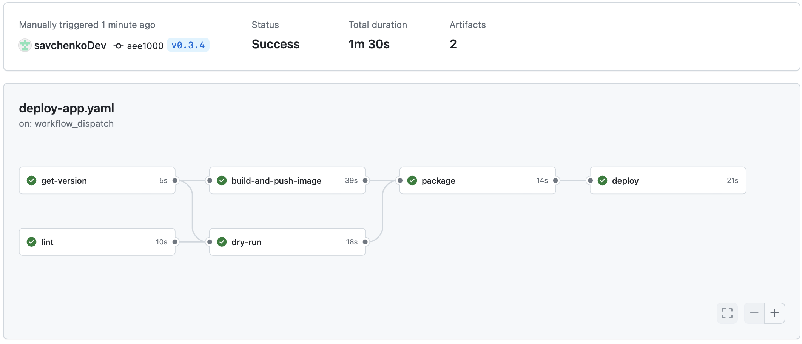

Тк не совсем понял какую именно версию надо проставлять, только образа или appVersion, по решил проставлять обе

Для этого в шаг со сборкой пакета добавил опцию `--app-version ${{ env.VERSION_WITHOUT_V }}` и в шаге деплоя 
`--set image.tag=${{ env.VERSION_WITHOUT_V }}`

Проверил на тэгах `0.3.4` и `0.3.5`



в истории видно что версия чарта и приложения меняется
```bash
➜  workshop_kubernetes git:(day-3) helm history rails-app
REVISION        UPDATED                         STATUS          CHART           APP VERSION     DESCRIPTION     
1               Mon Jun 24 11:05:24 2024        superseded      rails-app-0.3.4 0.3.4           Install complete
2               Mon Jun 24 11:08:19 2024        deployed        rails-app-0.3.5 0.3.5           Upgrade complete
```

И вот еще скрин как пруф что я не руками это напечатал

